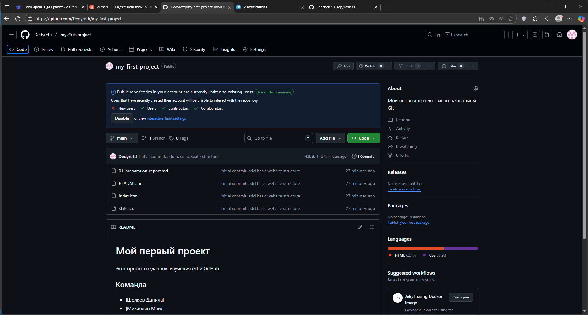

# Отчет по настройке GitHub

**Дата:** [29/09/2025]  
**Команда:** [Шелков Данила] и [Микаелян Маис]

## Выполненные действия:

### Шаг 2.1: Создание репозитория на GitHub
- URL репозитория: [https://github.com/Dedyretti/my-first-project.git]
- Видимость: Public
- [+] Репозиторий создан без README

### Шаг 2.2: Связывание репозиториев
- [+] Команда git remote add выполнена
- [+] Ветка переименована в main
- [+] Push выполнен успешно

## Проверка:
1. Откройте репозиторий на GitHub
2. [+] Файлы index.html, style.css, README.md отображаются
3. [+] История коммитов показывает "Initial commit"

## Скриншоты:

## Проблемы и решения:
 Ошибка 403 - удаление старых учетных данных через win+r - control

## Вывод:
 можно пушить не только через интерфейс гитх